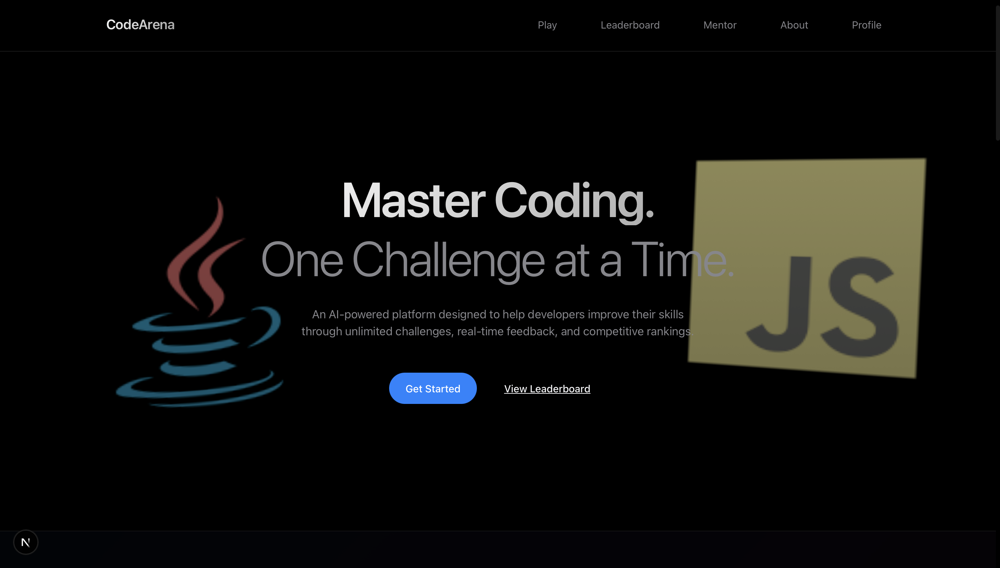
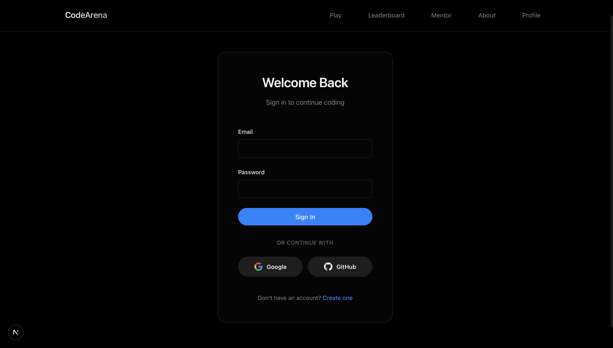
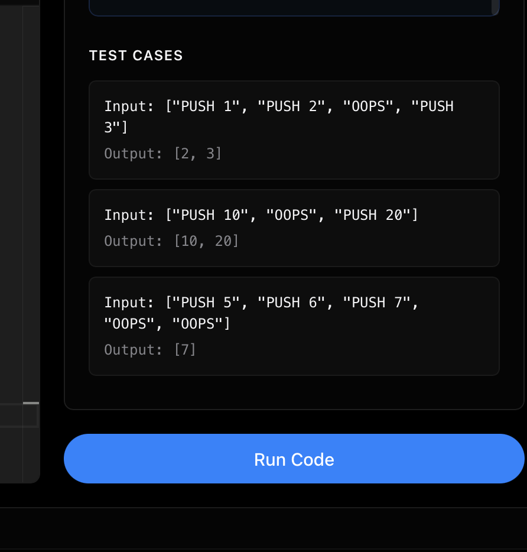
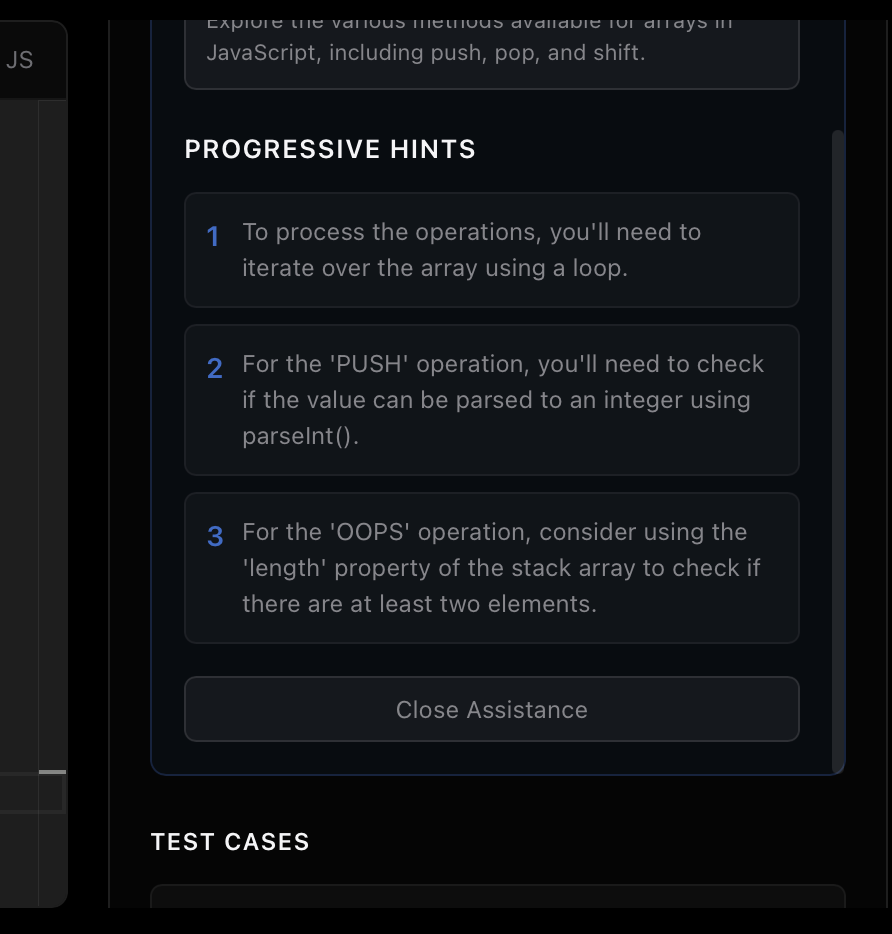
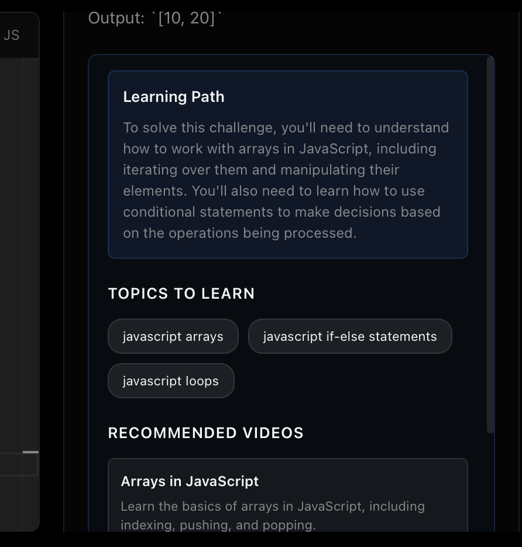
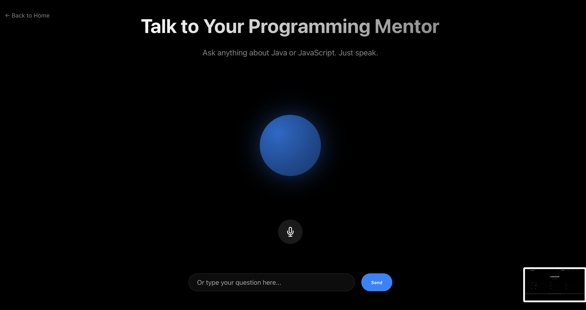
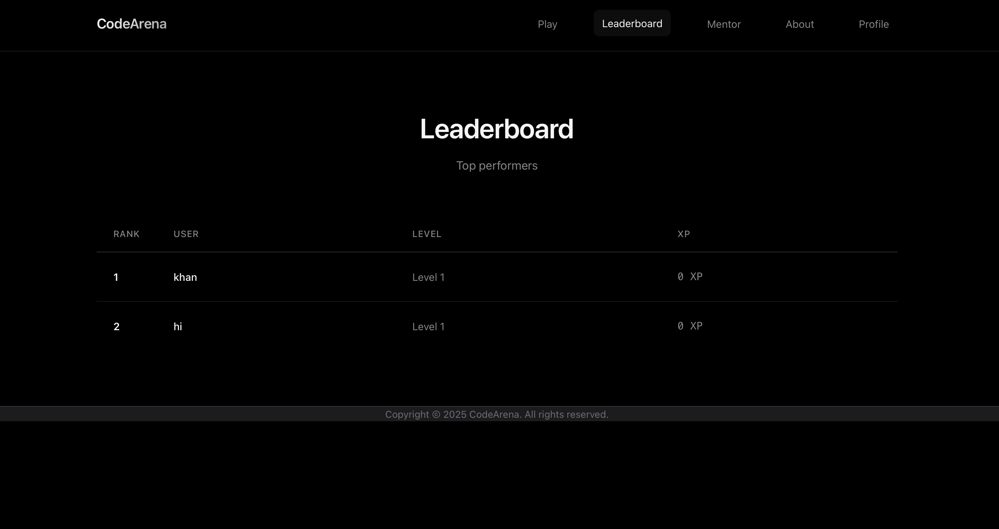
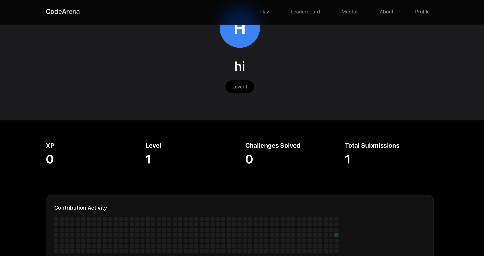
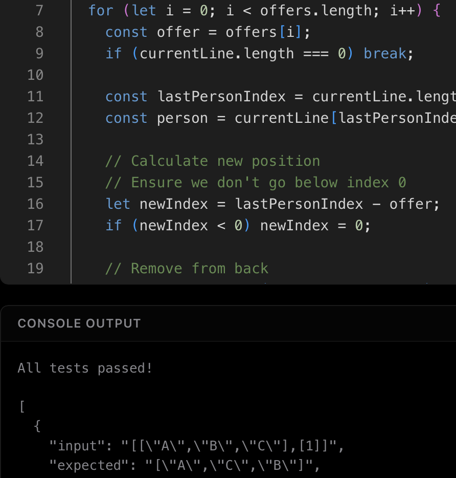
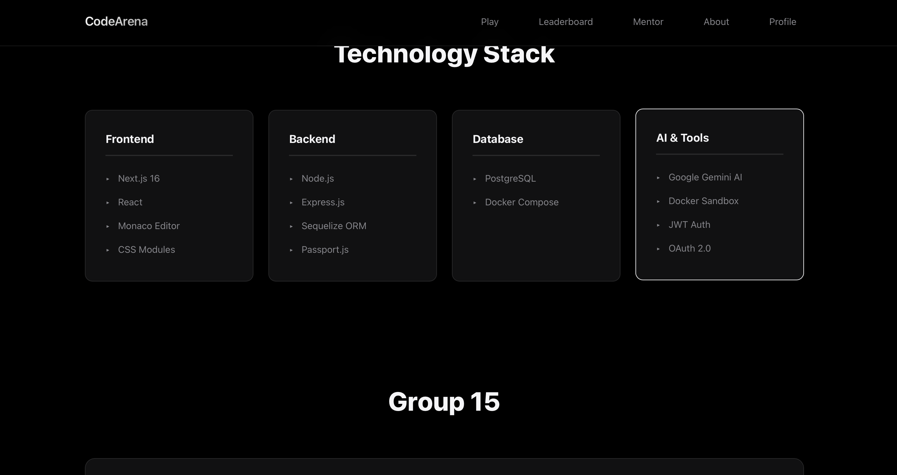

# CodeArena Demo & Screenshots

This document showcases the CodeArena platform through visual demonstrations and screenshots of key features.

## Table of Contents

1. [Homepage](#homepage)
2. [Authentication](#authentication)
3. [Challenge Playground](#challenge-playground)
4. [AI Assistance](#ai-assistance)
5. [Mentor Feature](#mentor-feature)
6. [Leaderboard](#leaderboard)
7. [User Profile](#user-profile)
8. [Code Execution](#code-execution)
9. [About Page](#about-page)

## Homepage

The CodeArena homepage features a modern, dark-themed design with a clear value proposition and intuitive navigation.



**Header Navigation:**
- **Logo**: "CodeArena" displayed prominently in the top-left corner
- **Navigation Links**: Play, Leaderboard, Mentor, About, and Profile links in the top-right
- Clean, minimalist navigation bar

**Main Content:**
- **Headline**: "Master Coding." - Bold, prominent white text
- **Subheadline**: "One Challenge at a Time." - Supporting grey text
- **Value Proposition**: "An AI-powered platform designed to help developers improve their skills through unlimited challenges, real-time feedback, and competitive rankings."
- **Call-to-Action Buttons**:
  - Primary: "Get Started" button (blue, prominent)
  - Secondary: "View Leaderboard" text link

**Visual Elements:**
- **Java Logo**: Stylized coffee cup icon with blue cup and red/orange flames (left side)
- **JavaScript Logo**: Yellow sticky note icon with "JS" letters (right side)
- Dark theme with white and grey text for optimal readability
- Modern, clean design aesthetic

**Key Features Highlighted:**
- AI-powered platform emphasis
- Unlimited challenges
- Real-time feedback
- Competitive rankings
- Developer skill improvement focus

## Authentication

### Login Page

The login page supports multiple authentication methods for user convenience.



**Authentication Options:**
- Email/Password authentication
- Google OAuth integration
- GitHub OAuth integration
- Secure session management

### Registration Page

New users can easily create an account with email or OAuth providers.


## Challenge Playground

The main coding interface where users solve challenges in real-time.

### Challenge Selection



Users can:
- Select difficulty level (Easy, Medium, Hard)
- Choose programming language (JavaScript, Java)
- Generate AI-powered challenges instantly

### Code Editor Interface


**Features:**
- Monaco Editor with syntax highlighting
- Real-time code editing
- Language-specific templates
- Test case preview
- Console output panel

### Challenge Description Panel


Each challenge includes:
- Clear problem description
- Example test cases
- Difficulty badge
- Template code structure

## AI Assistance

The AI assistance feature provides personalized learning guidance directly in the coding interface.

### AI Help Panel



**AI Assistance Features:**
- **Learning Path**: Overview of concepts needed for the challenge
- **Topics to Learn**: Specific programming topics identified by AI
- **YouTube Videos**: Curated video recommendations with descriptions
- **Progressive Hints**: Multiple hints that guide without giving away solutions

### Topics Display



The AI identifies relevant topics such as:
- Array manipulation
- Two pointers technique
- Hash maps
- Algorithm design patterns

### Video Recommendations


Each recommended video includes:
- Video title
- Direct YouTube link
- Description of content
- Relevance to current challenge

### Progressive Hints


Hints are provided in a progressive manner:
1. General guidance
2. More specific direction
3. Detailed approach (without full solution)

## Mentor Feature

The AI mentor provides voice and text-based assistance for learning programming concepts.



**Mentor Capabilities:**
- Voice input support
- Text-based chat
- Focused on Java and JavaScript
- Educational responses
- Code examples and explanations

## Leaderboard

Competitive ranking system showing top performers.



**Leaderboard Features:**
- Global rankings
- XP (Experience Points) display
- User levels
- Submission statistics
- Profile links

## User Profile

Comprehensive user profile page showing statistics and achievements.



**Profile Information:**
- Username and avatar
- Total XP and level
- Challenges completed
- Submission history
- Contribution graph
- Recent activity

## Code Execution

### Test Results



**Execution Features:**
- Real-time code execution
- Test case validation
- Detailed output display
- Error handling and debugging
- Performance feedback

### Success State


When all tests pass:
- Success message
- XP awarded notification
- Next challenge suggestion
- Achievement unlock

## Visual Features

### 3D Background Animation

The homepage features an interactive Three.js particle system that creates an engaging visual experience.


### Queue Visualizer

For specific challenges, an interactive queue visualizer helps users understand data structure operations.


**Visualizer Features:**
- Step-by-step animation
- Visual representation of queue operations
- Interactive controls (play, pause, step forward/backward)
- Current state highlighting

## Responsive Design

CodeArena is fully responsive and works seamlessly on different screen sizes.

### Mobile View


**Mobile Features:**
- Touch-friendly interface
- Responsive layout
- Optimized code editor
- Mobile navigation

### Tablet View


## About Page

The About page provides information about the CodeArena platform, its mission, and features.



**About Page Features:**
- Platform overview and mission statement
- Feature highlights and capabilities
- Technology stack information
- Community and contribution information
- Contact details

## Technology Stack

The platform showcases modern web technologies:

- **Frontend**: Next.js, React, Three.js
- **Backend**: Express.js, Node.js
- **Database**: PostgreSQL
- **AI Integration**: Groq API, Google Gemini
- **Code Execution**: Docker containers
- **Styling**: CSS Modules

## Getting Started

To see CodeArena in action:

1. Visit the homepage at `http://localhost:3000`
2. Register or login with your account
3. Navigate to the Play section
4. Generate a challenge
5. Click "AI Help" to see the assistance feature
6. Write and submit your solution
7. Check your progress on the leaderboard

## Screenshot Guidelines

When adding screenshots to this document:

1. **File Format**: Use PNG format for best quality
2. **Naming Convention**: Use descriptive names (e.g., `homepage.png`, `ai-assistance.png`)
3. **Location**: Place all screenshots in the `screenshots/` directory
4. **Dimensions**: Recommended width: 1200-1920px
5. **File Size**: Optimize images to keep repository size manageable

### How to Add Screenshots

1. Take a screenshot of the feature you want to showcase
2. Save it in the `screenshots/` directory with a descriptive name
3. Update this document with the image reference:
   ```markdown
   
   ```
4. Commit both the screenshot and updated DEMO.md file

## Feature Highlights

### AI-Powered Challenge Generation
- Unlimited unique challenges
- Difficulty-based problem generation
- Language-specific templates
- Diverse problem categories

### Real-Time Code Execution
- Secure Docker-based execution
- Multiple language support
- Instant feedback
- Test case validation

### Learning Assistance
- AI-generated hints
- Topic identification
- Video recommendations
- Progressive guidance

### Competitive Elements
- Global leaderboard
- XP and leveling system
- Achievement tracking
- Progress visualization

## Future Enhancements

Planned features for future releases:

- [ ] More programming languages (Python, C++, etc.)
- [ ] Collaborative coding sessions
- [ ] Code review and feedback system
- [ ] Custom challenge creation
- [ ] Tournament mode
- [ ] Mobile app version
- [ ] Advanced analytics dashboard

## Contributing

If you'd like to add more screenshots or improve this demo documentation:

1. Fork the repository
2. Add your screenshots to the `screenshots/` directory
3. Update this DEMO.md file
4. Submit a pull request

## Contact

For questions or feedback about CodeArena, please visit our GitHub repository or contact the maintainers.

---

*Last updated: December 2025*
